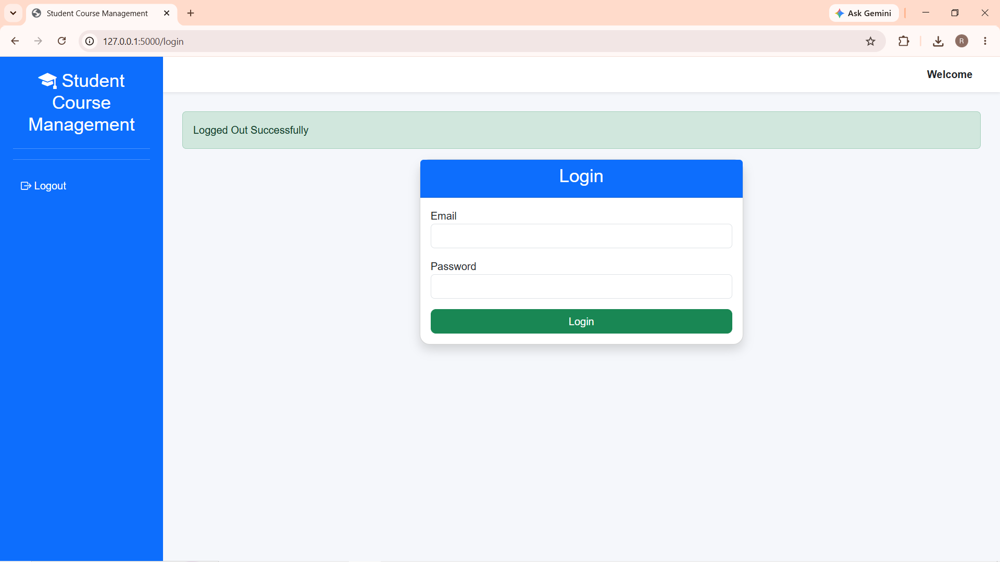
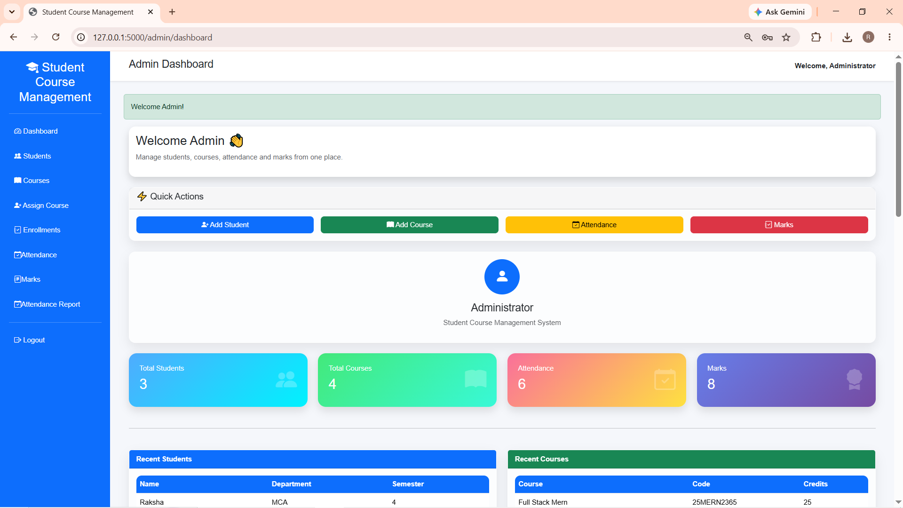
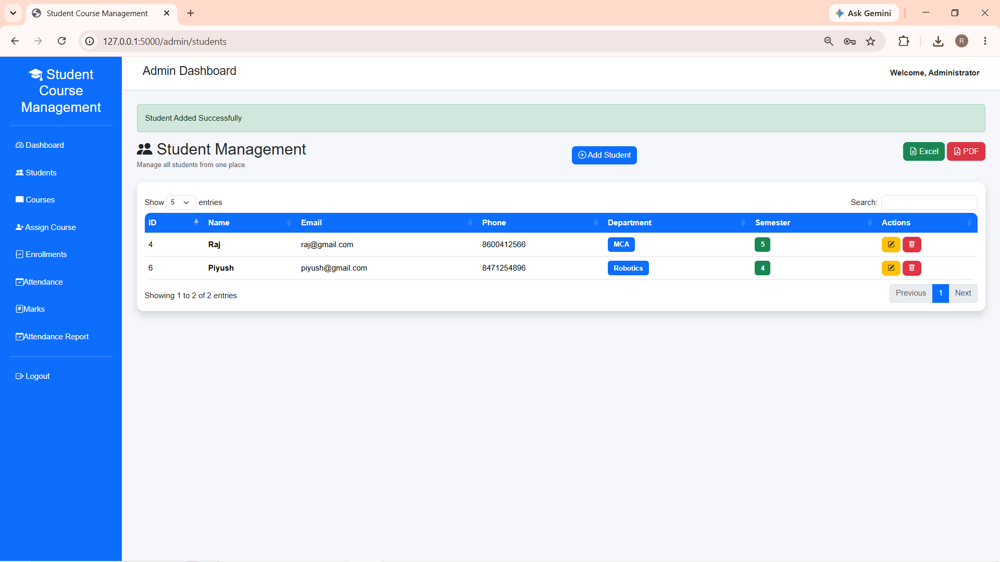
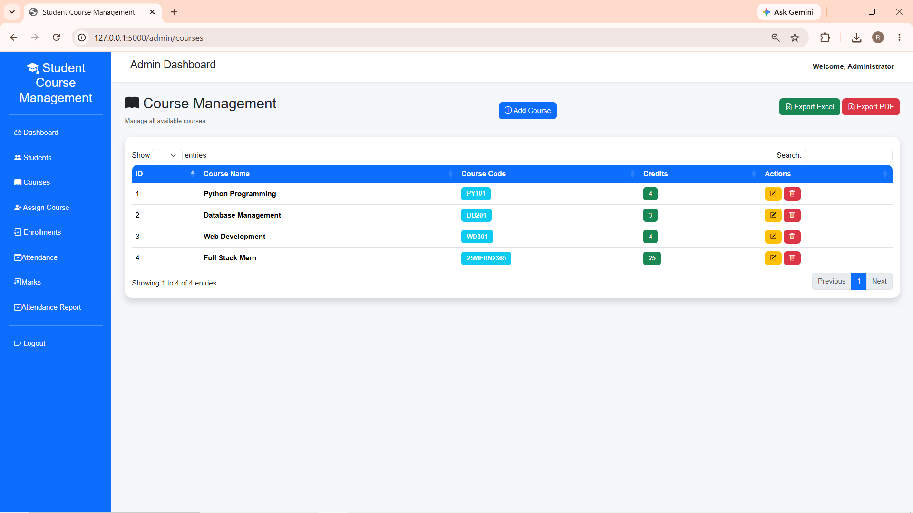
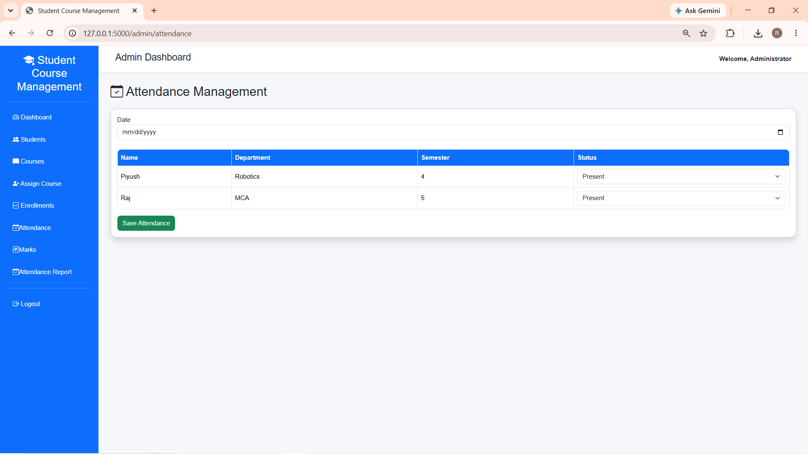
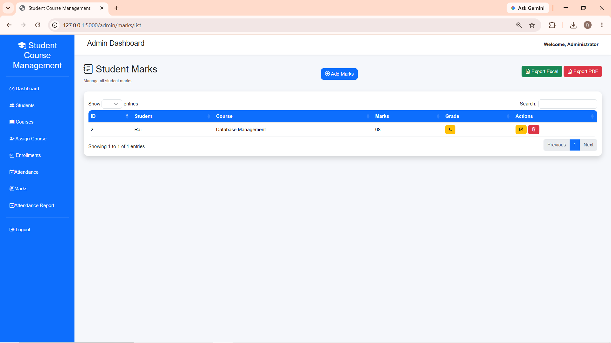

# 🎓 Student Course Management System

A full-stack Student Course Management System developed using **Python**, **Flask**, and **MySQL**. The system allows administrators to manage students, courses, attendance, marks, and enrollments, while students can securely log in to view their academic details.

---

## 📌 Features

### 👨‍💼 Admin Module
- Admin Login
- Dashboard with Charts
- Student Management (CRUD)
- Course Management (CRUD)
- Student Enrollment
- Attendance Management
- Marks Management
- Search & Pagination
- Export Student Data to Excel
- Export Marksheet to PDF
- Delete Confirmation using SweetAlert

### 👨‍🎓 Student Module
- Secure Login
- Student Dashboard
- View Profile
- View Enrolled Courses
- View Attendance
- View Marks
- Download Marksheet (PDF)

---

## 🛠️ Technologies Used

### Backend
- Python 3
- Flask
- Flask-MySQLdb

### Frontend
- HTML5
- CSS3
- Bootstrap 5
- JavaScript
- jQuery
- DataTables
- Chart.js
- Bootstrap Icons

### Database
- MySQL

### Libraries
- ReportLab (PDF)
- OpenPyXL (Excel)
- bcrypt (Password Hashing)

---

## 📂 Project Structure

```
student-course-management/
│
├── app.py
├── config.py
├── requirements.txt
├── schema.sql
├── README.md
│
├── routes/
│   ├── admin.py
│   ├── auth.py
│   └── student.py
│
├── templates/
│   ├── admin/
│   ├── auth/
│   ├── student/
│   └── base.html
│
├── static/
│   ├── css/
│   ├── js/
│   └── images/
│
├── utils/
│
└── exports/
```

---

## ⚙️ Installation

### 1. Clone Repository

```bash
git clone https://github.com/your-username/student-course-management.git
```

### 2. Open Project

```bash
cd student-course-management
```

### 3. Create Virtual Environment

```bash
python -m venv venv
```

### 4. Activate Environment

Windows

```bash
venv\Scripts\activate
```

Linux / macOS

```bash
source venv/bin/activate
```

### 5. Install Dependencies

```bash
pip install -r requirements.txt
```

### 6. Create Database

```sql
CREATE DATABASE student_management;
```

Import:

```
schema.sql
```

### 7. Configure Database

Update:

```
config.py
```

```python
MYSQL_HOST = "localhost"
MYSQL_USER = "root"
MYSQL_PASSWORD = "your_password"
MYSQL_DB = "student_management"
```

### 8. Run Project

```bash
python app.py
```

Open:

```
http://127.0.0.1:5000
```

---

## 📸 Screenshots

### Login



---

### Admin Dashboard



---

### Student Management



---

### Course Management



---

### Attendance Management



---

### Marks Management



---

## 🔐 Default Login

### Admin

```
Username : admin
Password : admin123
```

### Student

Use the student credentials created in the database.

---

## 🚀 Future Enhancements

- Email Notifications
- OTP Login
- REST API
- Docker Deployment
- Cloud Hosting

---

## 👨‍💻 Developed By

**Raj Chaudhari**

Full Stack Developer

Technologies:
Python • Flask • MySQL • JavaScript • Bootstrap

---